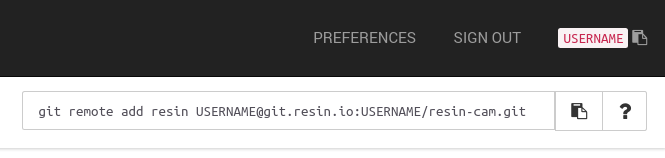

# resin-cam-uv4l
A smart, Raspberry Pi streaming camera based on [UV4L]().

### **[Bill of Materials](docs/BoM.md)**

## Getting started

- Sign up on [resin.io](https://dashboard.resin.io/signup)
- Select your Raspberry Pi's version and create a new application
- Follow the instructions on downloading and flashing [resinOS](https://resinos.io) to your Pi
- Clone this repository to your local workspace
- Set these variables in the `Fleet Configuration` application side tab
  - `RESIN_HOST_CONFIG_gpu_mem` = `196`
  - `RESIN_HOST_CONFIG_start_x` = `1`
- Add the _resin remote_ to your local workspace by running the useful command in the Resin dashboard
  

    

      Hint
    

    
  

- Push code to your device with a simple `git push resin master`
  - See the magic happening, your device is getting updated Over-The-Air!
- If you want your device to be accessible on WAN, enable its public URL
  - Select your device from the `Devices` side tab
  - Click the `Actions` side tab
  - Click the `ENABLE PUBLIC DEVICE URL` button
  - Note down your device's public URL!
- When your device finishes updating visit your device's IP or public URL to watch your stream!
  - You can find your device's IP on the dashboard

## Configure via [environment variables](https://docs.resin.io/management/env-vars/)
Variable Name | Default | Description
------------ | ------------- | -------------
width | `640` | video width
height | `480` | video height
framerate | `30` | video framerate

## License

Copyright 2017 Resinio Ltd.

Licensed under the Apache License, Version 2.0 (the "License"); you may not use this file except in compliance with the License. You may obtain a copy of the License at

<http://www.apache.org/licenses/LICENSE-2.0>

Unless required by applicable law or agreed to in writing, software distributed under the License is distributed on an "AS IS" BASIS, WITHOUT WARRANTIES OR CONDITIONS OF ANY KIND, either express or implied. See the License for the specific language governing permissions and limitations under the License.
